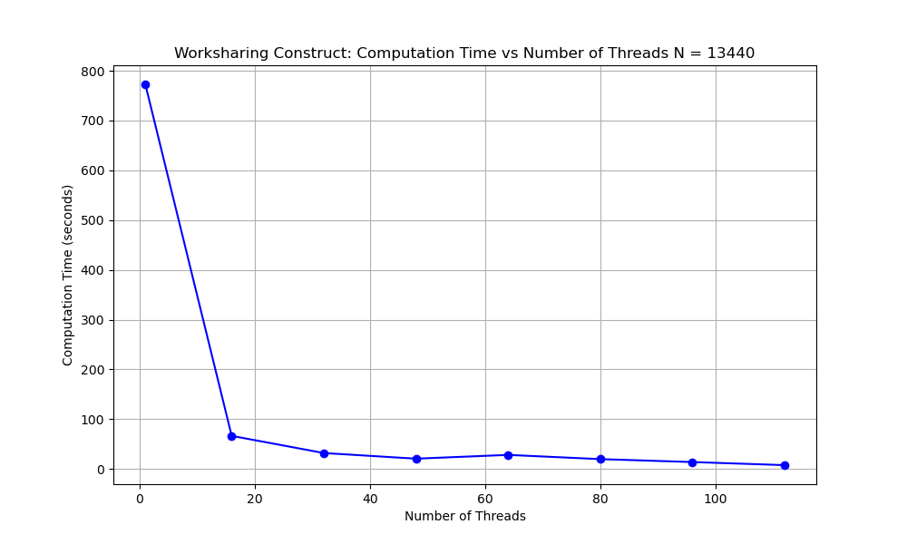
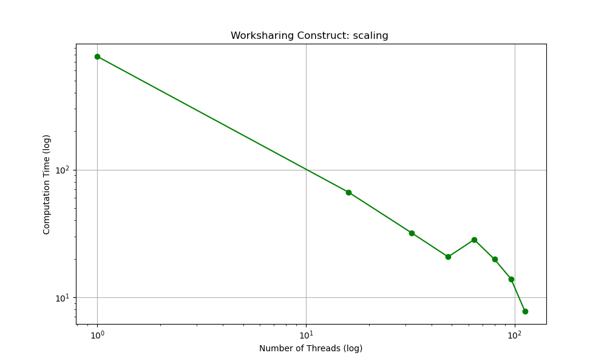
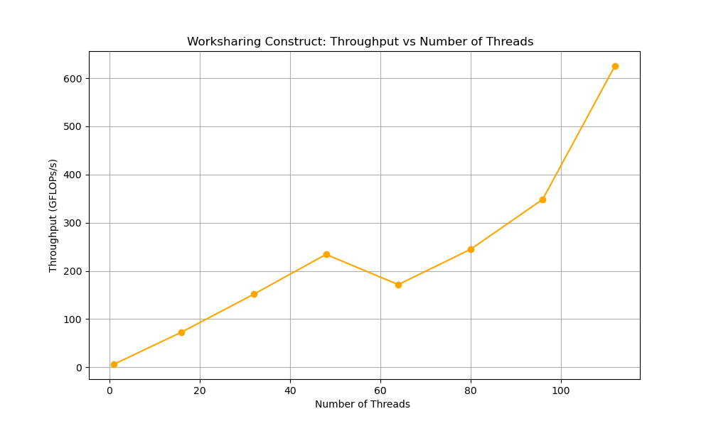
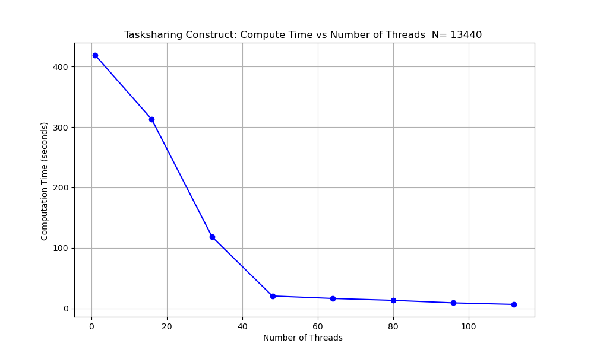
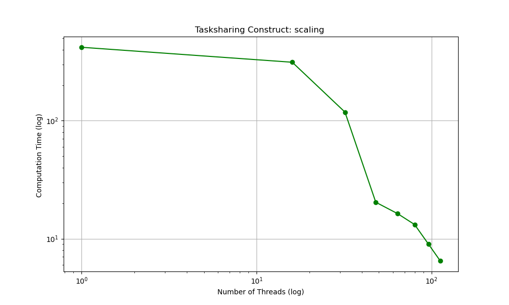
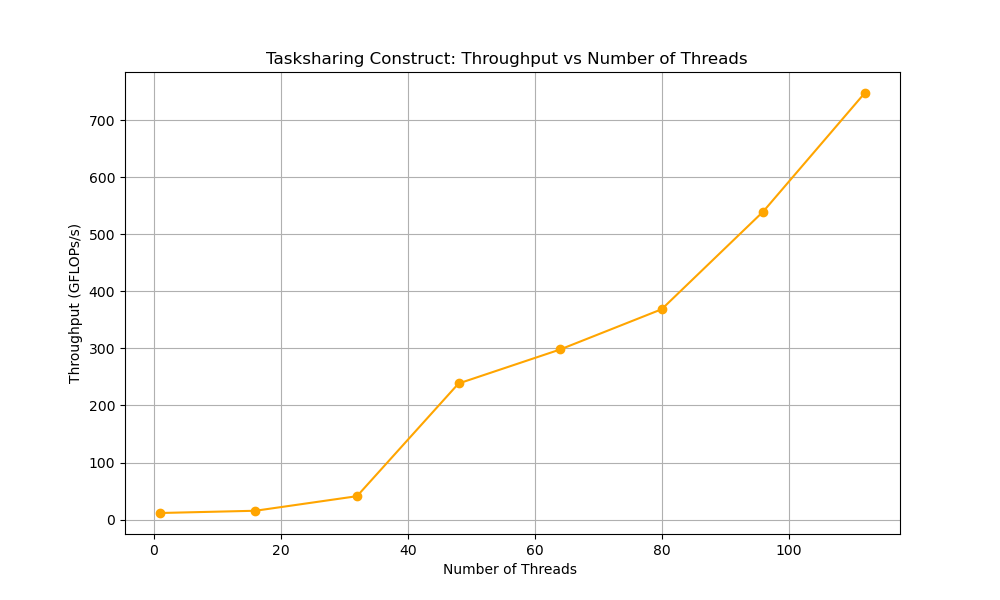
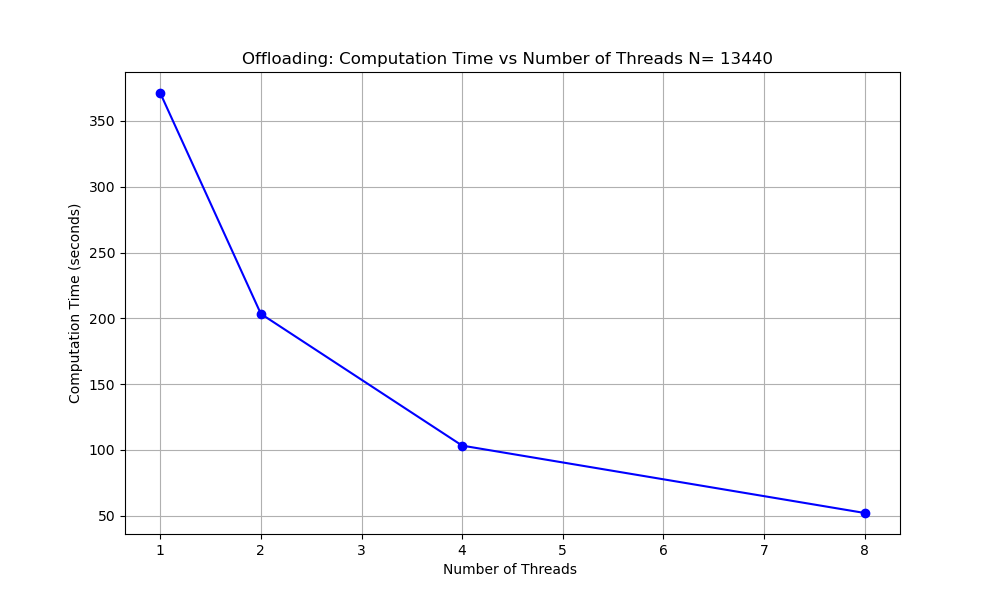
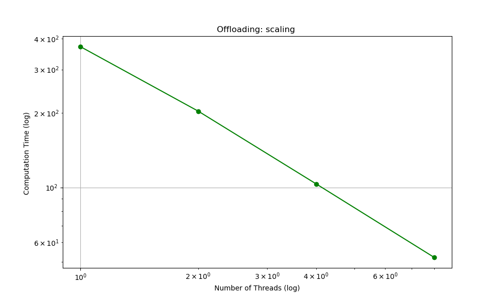
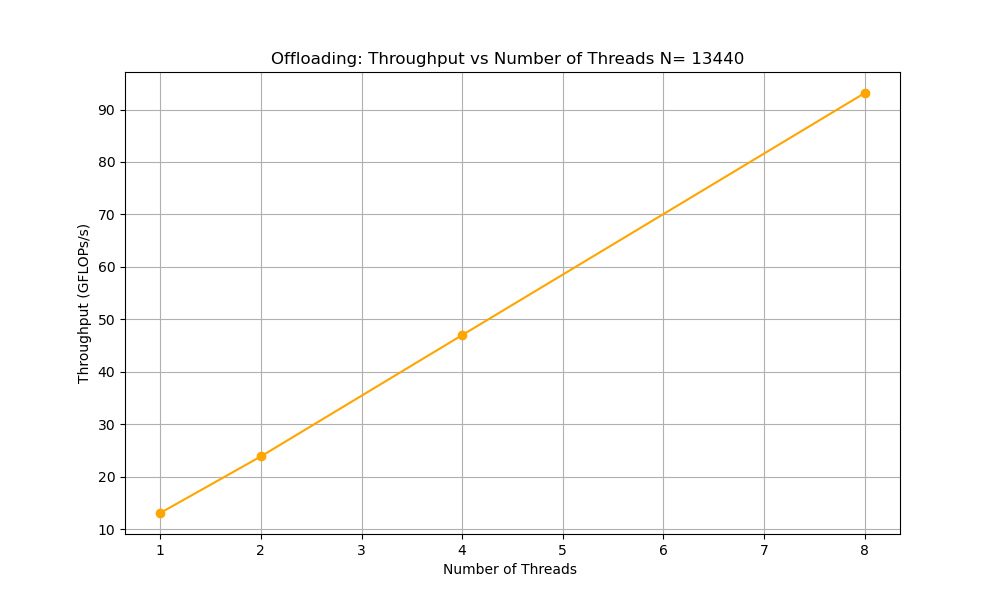

# Brief perfomance analysis of matrix-matrix multiplication using different OpenMP constructs

A serial version of a blocked  matrix-matrix multiplication program was parallellised using three different openmp constructs namely: worksharing, tasksharing and offloading. The resulting programs were then timed for performance analysis purposes. The size of matrix n used is 13440.

For the worksharing and tasksharing constructs , the choice of tile size greatly influenced the compute time and throughput. Consequently , choosing the tile size to be the same as the  number of cpus per task (threads) provided the most optimal result.

## Worksharing construct

## Tasksharing construct

## Offloading

